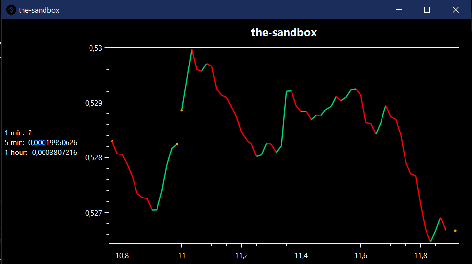

# Crypto_App
   

**Crypto_App** - *is a program that will help you search for the latest info on the crypto market*

**CoinCap** - *is a useful tool for real-time pricing and market activity for over 1,000 cryptocurrencies*

## Usage

:money_with_wings:  Choose currency 

:clock4: Select time

:point_right:  Click show

:heart_eyes: Wow 

## Сustomize

:mag: Search for currency

:watch: Select time to show

:new_moon_with_face: :first_quarter_moon: :full_moon_with_face: Set the theme to your taste

## Example

